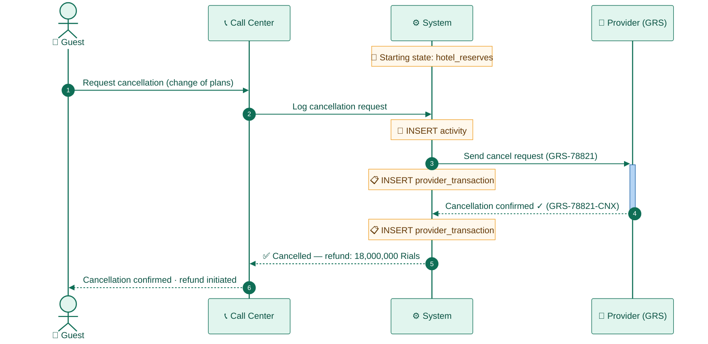

```mermaid
%%{init: {
"theme": "base",
"themeVariables": {
"primaryColor": "#E1F5EE",
"primaryTextColor": "#085041",
"primaryBorderColor": "#0F6E56",
"secondaryColor": "#EEEDFE",
"secondaryTextColor": "#26215C",
"secondaryBorderColor": "#534AB7",
"tertiaryColor": "#FAEEDA",
"tertiaryTextColor": "#412402",
"tertiaryBorderColor": "#854F0B",
"noteBkgColor": "#FFF8EC",
"noteTextColor": "#633806",
"noteBorderColor": "#EF9F27",
"activationBkgColor": "#B5D4F4",
"activationBorderColor": "#185FA5",
"signalColor": "#0F6E56",
"signalTextColor": "#085041",
"labelBoxBkgColor": "#F1EFE8",
"labelBoxBorderColor": "#B4B2A9",
"labelTextColor": "#2C2C2A",
"loopTextColor": "#2C2C2A",
"sequenceNumberColor": "#ffffff",
"fontFamily": "Segoe UI, sans-serif",
"fontSize": "14px"
}
}}%%
sequenceDiagram
autonumber
actor G as 🧑 Guest
participant CC as 📞 Call Center
participant S as ⚙️ System
participant P as 🏨 Provider (GRS)

    Note over S: 🏁 Starting state: hotel_reserves #1001<br/>status: confirmed · last snapshot #5005

    G->>CC: Request cancellation (change of plans)

    CC->>S: Log cancellation request
    Note over S: 💬 INSERT activity #4001<br/>type: comment · template_id: 2 · snapshot_id: NULL<br/>"Guest called to cancel. Checking cancellation policy."

    S->>+P: Send cancel request (GRS-78821)
    Note over S: 📋 INSERT provider_transaction #3001<br/>status: cancel_requested · is_success: true<br/>snapshot_id: NULL (no state change yet)

    P-->>-S: Cancellation confirmed ✓ (GRS-78821-CNX)
    Note over S: 📋 INSERT provider_transaction #3002 (snapshot_id: NULL initially)<br/>status: cancelled · is_success: true<br/>refund_amount: 18,000,000 Rials<br/>🔄 UPDATE status → cancelled<br/>📸 INSERT snapshot #5006<br/>🔗 UPDATE provider_transaction #3002 SET snapshot_id = 5006<br/>🎬 INSERT activity #4002<br/>type: action · template_id: 2 · snapshot_id: 5006<br/>"Cancelled per guest request. Full refund initiated."

    S-->>CC: ✅ Cancelled — refund: 18,000,000 Rials
    CC-->>G: Cancellation confirmed · refund initiated
```