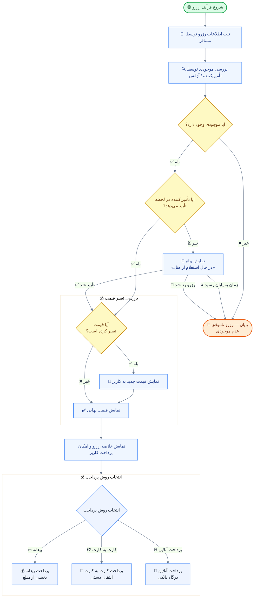

```mermaid
%%{init: {
 "theme": "base",
 "themeVariables": {
  "fontFamily": "Yekan, B Yekan, IRANYekan, Tahoma, sans-serif",
  "fontSize": "15px",
  "primaryColor": "#eef4ff",
  "primaryBorderColor": "#3b82f6",
  "primaryTextColor": "#1e293b",
  "lineColor": "#64748b"
 }
}}%%

flowchart TD
  Start([🟢 شروع فرآیند رزرو]) --> Step1[📝 ثبت اطلاعات رزرو توسط مسافر]
  Step1 --> Step2[🔍 بررسی موجودی توسط تأمین‌کننده / آژانس]
  Step2 --> Cond1{آیا موجودی وجود دارد؟}
  Cond1 -- ❌ خیر --> Fail1([🔴 پایان — رزرو ناموفق<br/>عدم موجودی])
  Cond1 -- ✅ بله --> Step4{آیا تأمین‌کننده در لحظه<br/>تأیید می‌دهد؟}
  Step4 -- ✅ بله --> PriceCheck
  Step4 -- ⏳ خیر --> Step6[🏨 نمایش پیام<br/>«در حال استعلام از هتل»]
  Step6 -- ✅ تأیید شد --> PriceCheck
  Step6 -- ⌛ زمان به پایان رسید --> Fail1
  Step6 -- 🚫 رزرو رد شد --> Fail1

  subgraph PriceBlock [💰 بررسی تغییر قیمت]
    direction TB
    PriceCheck{آیا قیمت<br/>تغییر کرده است؟}
    PriceCheck -- ✅ بله --> ShowNewPrice[📢 نمایش قیمت جدید به کاربر]
    ShowNewPrice --> PriceOK[✔️ نمایش قیمت نهایی]
    PriceCheck -- ❌ خیر --> PriceOK
  end

  PriceOK --> Step5[نمایش خلاصه رزرو و امکان پرداخت کاربر]
    Step5 --> PaymentBlock
    subgraph PaymentBlock [💰 انتخاب روش پرداخت]
        direction TB
        PayChoice{انتخاب روش پرداخت}
        PayChoice -- 💵 بیعانه --> DepositPay[💰 پرداخت بیعانه<br/>بخشی از مبلغ]
        PayChoice -- 💳 کارت به کارت --> CardTransfer[🏦 پرداخت کارت به کارت<br/>انتقال دستی]
        PayChoice -- 🌐 پرداخت آنلاین --> OnlinePay[🔐 پرداخت آنلاین<br/>درگاه بانکی]
    end

  classDef startEnd fill:#dcfce7,stroke:#16a34a,stroke-width:2px,color:#14532d;
  classDef failEnd fill:#fee2e2,stroke:#dc2626,stroke-width:2px,color:#7f1d1d;
  classDef warnEnd fill:#ffedd5,stroke:#ea580c,stroke-width:2px,color:#7c2d12;
  classDef process fill:#eff6ff,stroke:#3b82f6,stroke-width:1.5px,color:#1e3a8a;
  classDef decision fill:#fef9c3,stroke:#ca8a04,stroke-width:1.5px,color:#713f12;
  classDef priceBox fill:#f0fdfa,stroke:#0d9488,stroke-width:1.5px,color:#134e4a;

  class Start,Success startEnd;
  class Fail1,Fail2,Fail3 warnEnd;
  class Step1,Step2,Step5,Step6,ShowNewPrice,PriceOK process;
  class Cond1,Cond2,Step4,PriceCheck,UserConfirm decision;
```