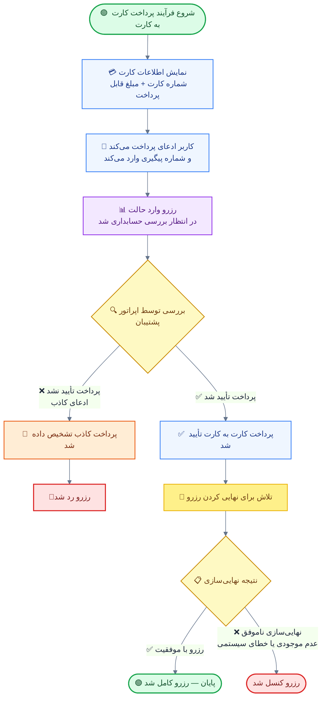

```mermaid
%%{init: {
  "theme": "base",
  "themeVariables": {
    "fontFamily": "Yekan, B Yekan, IRANYekan, Tahoma, sans-serif",
    "fontSize": "15px",
    "primaryColor": "#eef4ff",
    "primaryBorderColor": "#3b82f6",
    "primaryTextColor": "#1e293b",
    "lineColor": "#64748b"
  }
}}%%
flowchart TD
    Start([🟢 شروع فرآیند پرداخت کارت به کارت]) --> ShowCardInfo[💳 نمایش اطلاعات کارت<br/>شماره کارت + مبلغ قابل پرداخت]
    
    ShowCardInfo --> UserClaim[📝 کاربر ادعای پرداخت می‌کند<br/>و شماره پیگیری وارد می‌کند]
    
    UserClaim --> ReservationToAccounting[📊 رزرو وارد حالت<br/>در انتظار بررسی حسابداری شد]
    
    ReservationToAccounting --> OperatorReview{🔍 بررسی توسط اپراتور<br/>پشتیبان}
    
    OperatorReview -- ❌ پرداخت تأیید نشد<br/>ادعای کاذب --> FakePayment[🚫 پرداخت کاذب تشخیص داده شد]
    
    FakePayment --> ReservationRejected[🔴رزرو رد شد]
    
    OperatorReview -- ✅ پرداخت تأیید شد --> PaymentConfirmed[✅ پرداخت کارت به کارت تأیید شد]
    
    PaymentConfirmed --> TryFinalize[🔄 تلاش برای نهایی کردن رزرو<br/>]
    
    TryFinalize --> FinalizeResult{📋 نتیجه نهایی‌سازی}
    
    FinalizeResult -- ✅ رزرو با موفقیت --> EndSuccess([🟢 پایان — رزرو کامل شد])
    
    FinalizeResult -- ❌ نهایی‌سازی ناموفق<br/>عدم موجودی یا خطای سیستمی --> EndCancelled([رزرو کنسل شد])

    classDef startEnd fill:#dcfce7,stroke:#16a34a,stroke-width:2px,color:#14532d;
    classDef failEnd fill:#fee2e2,stroke:#dc2626,stroke-width:2px,color:#7f1d1d;
    classDef process fill:#eff6ff,stroke:#3b82f6,stroke-width:1.5px,color:#1e3a8a;
    classDef decision fill:#fef9c3,stroke:#ca8a04,stroke-width:1.5px,color:#713f12;
    classDef accounting fill:#f3e8ff,stroke:#9333ea,stroke-width:1.5px,color:#581c87;
    classDef refund fill:#ffedd5,stroke:#ea580c,stroke-width:1.5px,color:#7c2d12;
    classDef warning fill:#fef08a,stroke:#eab308,stroke-width:1.5px,color:#713f12;

    class Start,EndSuccess startEnd;
    class ReservationRejected,EndCancelled failEnd;
    class ShowCardInfo,UserClaim,PaymentConfirmed,ReservationFinalized,ShowVoucher,ShowCancelPage process;
    class OperatorReview,FinalizeResult decision;
    class ReservationToAccounting accounting;
    class FakePayment,FinalizeFailed,StartRefund,ReservationCancelled refund;
    class TryFinalize warning;
```
