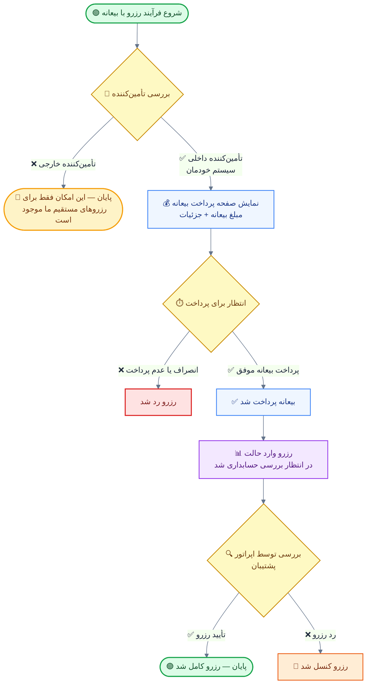

```mermaid
%%{init: {
  "theme": "base",
  "themeVariables": {
    "fontFamily": "Yekan, B Yekan, IRANYekan, Tahoma, sans-serif",
    "fontSize": "15px",
    "primaryColor": "#eef4ff",
    "primaryBorderColor": "#3b82f6",
    "primaryTextColor": "#1e293b",
    "lineColor": "#64748b"
  }
}}%%
flowchart TD
    Start([🟢 شروع فرآیند رزرو با بیعانه]) --> CheckSupplier{🏢 بررسی تأمین‌کننده}
    
    CheckSupplier -- ❌ تأمین‌کننده خارجی --> NotAvailable([🔴 پایان — این امکان فقط برای<br/>رزروهای مستقیم ما موجود است])
    
    CheckSupplier -- ✅ تأمین‌کننده داخلی<br/>سیستم خودمان --> ShowDepositPayment[💰 نمایش صفحه پرداخت بیعانه<br/>مبلغ بیعانه + جزئیات]
    
    ShowDepositPayment --> WaitPayment{⏱️ انتظار برای پرداخت}
    
    WaitPayment -- ❌ انصراف یا عدم پرداخت --> ReservationRejected2[رزرو رد شد]
    
    WaitPayment -- ✅ پرداخت بیعانه موفق --> DepositPaid[✅ بیعانه پرداخت شد]
    
    DepositPaid --> ReservationToAccounting[📊 رزرو وارد حالت<br/>در انتظار بررسی حسابداری شد]

    
    ReservationToAccounting --> OperatorReview{🔍 بررسی توسط اپراتور<br/>پشتیبان}
    
    OperatorReview -- ✅ تأیید رزرو --> EndSuccess([🟢 پایان — رزرو کامل شد])
    
    OperatorReview -- ❌ رد رزرو --> ReservationRejected[🚫 رزرو کنسل شد]


    classDef startEnd fill:#dcfce7,stroke:#16a34a,stroke-width:2px,color:#14532d;
    classDef failEnd fill:#fee2e2,stroke:#dc2626,stroke-width:2px,color:#7f1d1d;
    classDef warnEnd fill:#fef3c7,stroke:#f59e0b,stroke-width:2px,color:#78350f;
    classDef process fill:#eff6ff,stroke:#3b82f6,stroke-width:1.5px,color:#1e3a8a;
    classDef decision fill:#fef9c3,stroke:#ca8a04,stroke-width:1.5px,color:#713f12;
    classDef accounting fill:#f3e8ff,stroke:#9333ea,stroke-width:1.5px,color:#581c87;
    classDef refund fill:#ffedd5,stroke:#ea580c,stroke-width:1.5px,color:#7c2d12;
        classDef failEnd fill:#fee2e2,stroke:#dc2626,stroke-width:2px,color:#7f1d1d;

    class Start,EndSuccess startEnd;
    class EndRejected failEnd;
    class CancelByUser,NotAvailable warnEnd;
    class ShowDepositPayment,DepositPaid,ReservationConfirmed,ShowVoucher,NotifyConfirm,ShowCancelPage,NotifyCancel process;
    class CheckSupplier,WaitPayment,OperatorReview decision;
    class ReservationToAccounting,NotifyUser accounting;
    class ReservationRejected,RefundProcess,RefundCompleted refund;
    class ReservationRejected2, failEnd;
```

