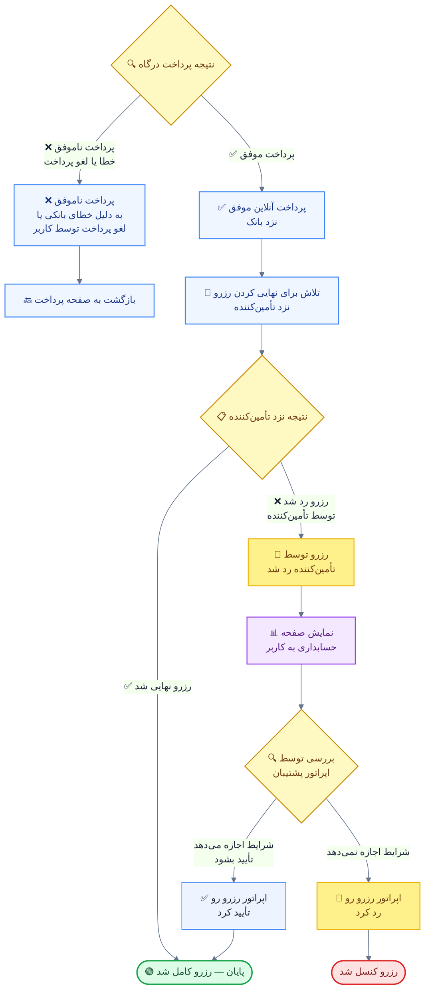

```mermaid
%%{init: {
  "theme": "base",
  "themeVariables": {
    "fontFamily": "Yekan, B Yekan, IRANYekan, Tahoma, sans-serif",
    "fontSize": "15px",
    "primaryColor": "#eef4ff",
    "primaryBorderColor": "#3b82f6",
    "primaryTextColor": "#1e293b",
    "lineColor": "#64748b"
  }
}}%%
flowchart TD
    GatewayResult{🔍 نتیجه پرداخت درگاه}
    
    GatewayResult -- ✅ پرداخت موفق --> PaymentSuccess[✅ پرداخت آنلاین موفق<br/>نزد بانک]
    
    GatewayResult -- ❌ پرداخت ناموفق<br/>خطا یا لغو پرداخت --> PaymentFailed[❌ پرداخت ناموفق<br/>به دلیل خطای بانکی یا<br/>لغو پرداخت توسط کاربر]
    
    PaymentFailed -->  BackToPayment[🔙 بازگشت به صفحه پرداخت]
    
    PaymentSuccess --> TryFinalize[🔄 تلاش برای نهایی کردن رزرو<br/>نزد تأمین‌کننده]
    
    TryFinalize --> SupplierResult{📋 نتیجه نزد تأمین‌کننده}
    
    SupplierResult -- ✅ رزرو نهایی شد --> EndSuccess([🟢 پایان — رزرو کامل شد])
    
    SupplierResult -- ❌ رزرو رد شد<br/>توسط تأمین‌کننده --> SupplierRejected[🚫 رزرو توسط<br/>تأمین‌کننده رد شد]
    
    SupplierRejected --> ShowAccounting[📊 نمایش صفحه<br/>حسابداری به کاربر]
    
    ShowAccounting --> OperatorReview{🔍 بررسی توسط<br/>اپراتور پشتیبان}
    
    OperatorReview -- شرایط اجازه می‌دهد<br/>تأیید بشود --> OperatorApproved[✅ اپراتور رزرو رو<br/>تأیید کرد]
    
    OperatorApproved --> EndSuccess([🟢 پایان — رزرو کامل شد])
    
    OperatorRejected --> EndRejected([رزرو کنسل شد])
    
    OperatorReview -- شرایط اجازه نمی‌دهد<br/> --> OperatorRejected[🚫 اپراتور رزرو رو<br/>رد کرد]


    classDef startEnd fill:#dcfce7,stroke:#16a34a,stroke-width:2px,color:#14532d;
    classDef failEnd fill:#fee2e2,stroke:#dc2626,stroke-width:2px,color:#7f1d1d;
    classDef process fill:#eff6ff,stroke:#3b82f6,stroke-width:1.5px,color:#1e3a8a;
    classDef decision fill:#fef9c3,stroke:#ca8a04,stroke-width:1.5px,color:#713f12;
    classDef accounting fill:#f3e8ff,stroke:#9333ea,stroke-width:1.5px,color:#581c87;
    classDef warning fill:#fef08a,stroke:#eab308,stroke-width:1.5px,color:#713f12;

    class EndSuccess startEnd;
    class EndCanceled,EndRejected failEnd;
    class PaymentSuccess,BackToPayment,PaymentFailed,TryFinalize,ReservationFinalized,ShowVoucher,ManualFinalize,ReservationApproved,ShowCancelPage process;
    class GatewayResult,RetryOrCancel,SupplierResult,OperatorReview,ManualResult decision;
    class ShowAccounting accounting;
    class SupplierRejected,OperatorRejected,ManualFailed warning;
```
