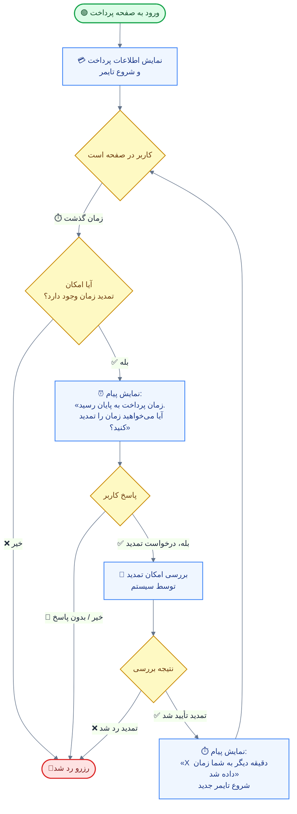

```mermaid
%%{init: {
  "theme": "base",
  "themeVariables": {
    "fontFamily": "Yekan, B Yekan, IRANYekan, Tahoma, sans-serif",
    "fontSize": "15px",
    "primaryColor": "#eef4ff",
    "primaryBorderColor": "#3b82f6",
    "primaryTextColor": "#1e293b",
    "lineColor": "#64748b"
  }
}}%%

flowchart TD
    Start([🟢 ورود به صفحه پرداخت]) --> ShowPayment[💳 نمایش اطلاعات پرداخت<br/>و شروع تایمر ]
    ShowPayment --> WaitUser{کاربر در صفحه است}
    WaitUser -- ⏱️ زمان گذشت --> TimeExpired{آیا امکان<br/>تمدید زمان وجود دارد؟}
    TimeExpired -- ❌ خیر --> ReservationRejected([🔴رزرو رد شد<br/>])
    TimeExpired -- ✅ بله --> AskExtension[⏰ نمایش پیام:<br/>«زمان پرداخت به پایان رسید.<br/>آیا می‌خواهید زمان را تمدید کنید؟»]
    AskExtension --> UserChoice{پاسخ کاربر}
    UserChoice -- 🚫 خیر / بدون پاسخ --> ReservationRejected
    UserChoice -- ✅ بله، درخواست تمدید --> CheckExtension[🔄 بررسی امکان تمدید<br/>توسط سیستم]
    CheckExtension --> ExtensionResult{نتیجه بررسی}
    ExtensionResult -- ✅ تمدید تأیید شد --> ShowExtendedTime[⏱️ نمایش پیام:<br/>«X دقیقه دیگر به شما زمان داده شد»<br/>شروع تایمر جدید]
    ExtensionResult -- ❌ تمدید رد شد --> ReservationRejected
    ShowExtendedTime --> WaitUser

    classDef startEnd fill:#dcfce7,stroke:#16a34a,stroke-width:2px,color:#14532d;
    classDef failEnd fill:#fee2e2,stroke:#dc2626,stroke-width:2px,color:#7f1d1d;
    classDef process fill:#eff6ff,stroke:#3b82f6,stroke-width:1.5px,color:#1e3a8a;
    classDef decision fill:#fef9c3,stroke:#ca8a04,stroke-width:1.5px,color:#713f12;
    classDef warning fill:#ffedd5,stroke:#ea580c,stroke-width:1.5px,color:#7c2d12;

    class Start,End startEnd;
    class ReservationRejected, failEnd;
    class ShowPayment,PaymentDone,AskExtension,CheckExtension,ShowExtendedTime process;
    class WaitUser,TimeExpired,UserChoice,ExtensionResult decision;
```
